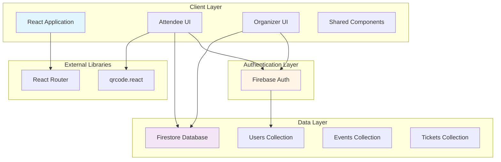

# Design Document: Event Management & Ticketing System

## Overview

The Event Management & Ticketing System is a React-based web application that enables attendees to discover and book event tickets while providing organizers with tools to manage events and validate attendees. The system uses Firebase for authentication and Firestore for data persistence, with QR codes generated using the qrcode.react library for ticket validation.

The architecture follows a component-based design with clear separation between attendee and organizer functionality. The system emphasizes real-time data synchronization, secure authentication, and a responsive user interface built with React and Tailwind CSS.

## Architecture

### High-Level Architecture



### Technology Stack

- **Frontend Framework**: React 18+ with functional components and hooks
- **Styling**: Tailwind CSS for responsive design
- **Authentication**: Firebase Authentication (email/password)
- **Database**: Cloud Firestore (NoSQL document database)
- **QR Code Generation**: qrcode.react library (SVG-based rendering)
- **Routing**: React Router v6 for navigation and protected routes
- **State Management**: React Context API for global state (user auth, cart)
- **Deployment**: Vercel or Netlify for static hosting

### Application Flow

**Attendee Flow:**
1. User visits landing page → Event listing
2. User clicks event → Event details page
3. User clicks "Book Ticket" → Authentication check
4. If not authenticated → Redirect to login/signup
5. If authenticated → Create booking → Generate QR code
6. Display ticket with QR code → Store in "My Tickets"

**Organizer Flow:**
1. Organizer logs in with organizer credentials
2. Access organizer dashboard → View event statistics
3. Select event → View attendee list
4. Access validation screen → Scan/input ticket ID
5. Validate ticket → Display validation result

## Components and Interfaces

### Component Hierarchy

```
App
├── AuthProvider (Context)
├── Router
│   ├── PublicRoutes
│   │   ├── Home (Event Listing)
│   │   ├── EventDetails
│   │   ├── Login
│   │   └── Signup
│   ├── ProtectedRoutes (Attendee)
│   │   ├── MyTickets
│   │   └── Profile
│   └── OrganizerRoutes (Organizer)
│       ├── OrganizerDashboard
│       ├── AttendeeList
│       └── TicketValidation
└── SharedComponents
    ├── Navbar
    ├── EventCard
    ├── TicketQR
    └── LoadingSpinner
```

### Core Components

#### 1. AuthProvider (Context)
**Purpose**: Manages authentication state globally

**State:**
```typescript
interface AuthContextType {
  currentUser: User | null;
  isOrganizer: boolean;
  loading: boolean;
  login: (email: string, password: string) => Promise<void>;
  signup: (email: string, password: string, name: string) => Promise<void>;
  logout: () => Promise<void>;
}
```

**Responsibilities:**
- Initialize Firebase Auth listener
- Maintain current user state
- Provide authentication methods
- Check user role (attendee vs organizer)

#### 2. Home (Event Listing Page)
**Purpose**: Display all available events

**Props:** None (fetches data internally)

**State:**
```typescript
interface HomeState {
  events: Event[];
  loading: boolean;
  searchQuery: string;
  filteredEvents: Event[];
}
```

**Responsibilities:**
- Fetch events from Firestore
- Display event cards in grid layout
- Implement search/filter functionality
- Show "Sold Out" badges
- Handle navigation to event details

#### 3. EventDetails
**Purpose**: Display detailed information about a specific event

**Props:**
```typescript
interface EventDetailsProps {
  eventId: string; // from URL params
}
```

**State:**
```typescript
interface EventDetailsState {
  event: Event | null;
  loading: boolean;
  bookingInProgress: boolean;
}
```

**Responsibilities:**
- Fetch event details by ID
- Display complete event information
- Handle ticket booking action
- Check booking eligibility (auth, availability, date)
- Navigate to ticket confirmation

#### 4. TicketQR Component
**Purpose**: Generate and display QR code for tickets

**Props:**
```typescript
interface TicketQRProps {
  ticketId: string;
  eventName: string;
  eventDate: string;
  attendeeName: string;
}
```

**Implementation:**
```typescript
import { QRCodeSVG } from 'qrcode.react';

const TicketQR = ({ ticketId, eventName, eventDate, attendeeName }) => {
  return (
    <div className="ticket-container">
      <QRCodeSVG 
        value={ticketId}
        size={256}
        level="H"
        includeMargin={true}
      />
      <div className="ticket-details">
        <p>{eventName}</p>
        <p>{eventDate}</p>
        <p>{attendeeName}</p>
        <p>Ticket ID: {ticketId}</p>
      </div>
    </div>
  );
};
```

**Responsibilities:**
- Render QR code using qrcode.react
- Display ticket metadata
- Provide download functionality (optional)

#### 5. MyTickets
**Purpose**: Display all tickets booked by the current user

**State:**
```typescript
interface MyTicketsState {
  tickets: Ticket[];
  loading: boolean;
}
```

**Responsibilities:**
- Fetch user's tickets from Firestore
- Display tickets with QR codes
- Handle empty state
- Group tickets by event

#### 6. OrganizerDashboard
**Purpose**: Display event statistics for organizers

**State:**
```typescript
interface DashboardState {
  events: Event[];
  ticketStats: Map<string, TicketStats>;
  loading: boolean;
}

interface TicketStats {
  totalBooked: number;
  totalAvailable: number;
  revenue: number;
}
```

**Responsibilities:**
- Fetch all events
- Calculate ticket statistics per event
- Display event cards with stats
- Navigate to attendee list

#### 7. AttendeeList
**Purpose**: Display list of attendees for a specific event

**Props:**
```typescript
interface AttendeeListProps {
  eventId: string;
}
```

**State:**
```typescript
interface AttendeeListState {
  attendees: Attendee[];
  loading: boolean;
  searchQuery: string;
}

interface Attendee {
  name: string;
  email: string;
  ticketId: string;
  bookingDate: Date;
  validated: boolean;
}
```

**Responsibilities:**
- Fetch tickets for specific event
- Join with user data
- Display attendee information
- Show validation status
- Implement search functionality

#### 8. TicketValidation
**Purpose**: Validate tickets via QR scan or manual input

**State:**
```typescript
interface ValidationState {
  ticketId: string;
  validationResult: ValidationResult | null;
  scanning: boolean;
}

interface ValidationResult {
  valid: boolean;
  ticket?: Ticket;
  message: string;
  alreadyUsed: boolean;
}
```

**Responsibilities:**
- Accept ticket ID input (manual or scanned)
- Query Firestore for ticket
- Validate ticket authenticity
- Check if already validated
- Mark ticket as validated
- Display validation result

### Protected Route Components

#### ProtectedRoute
**Purpose**: Restrict access to authenticated users

```typescript
const ProtectedRoute = ({ children }) => {
  const { currentUser, loading } = useAuth();
  
  if (loading) return <LoadingSpinner />;
  
  return currentUser ? children : <Navigate to="/login" />;
};
```

#### OrganizerRoute
**Purpose**: Restrict access to organizer users

```typescript
const OrganizerRoute = ({ children }) => {
  const { currentUser, isOrganizer, loading } = useAuth();
  
  if (loading) return <LoadingSpinner />;
  
  if (!currentUser) return <Navigate to="/login" />;
  if (!isOrganizer) return <Navigate to="/" />;
  
  return children;
};
```

## Data Models

### Firestore Collections Structure

#### Users Collection (`users`)

```typescript
interface User {
  uid: string;              // Firebase Auth UID (document ID)
  email: string;
  name: string;
  role: 'attendee' | 'organizer';
  createdAt: Timestamp;
  bookingCount: number;     // Total tickets booked
}
```

**Indexes:**
- `email` (for lookups)
- `role` (for filtering organizers)

#### Events Collection (`events`)

```typescript
interface Event {
  id: string;               // Auto-generated document ID
  name: string;
  description: string;
  date: Timestamp;
  time: string;
  location: string;
  imageUrl: string;
  totalTickets: number;
  availableTickets: number;
  ticketPrice: number;      // Can be 0 for free events
  organizerId: string;      // Reference to user
  createdAt: Timestamp;
  tags: string[];           // For search/filter
}
```

**Indexes:**
- `date` (for sorting)
- `organizerId` (for organizer queries)
- `availableTickets` (for filtering sold out events)

#### Tickets Collection (`tickets`)

```typescript
interface Ticket {
  id: string;               // Auto-generated unique ticket ID (document ID)
  eventId: string;          // Reference to event
  userId: string;           // Reference to user
  eventName: string;        // Denormalized for quick access
  eventDate: Timestamp;     // Denormalized for quick access
  attendeeName: string;     // Denormalized for quick access
  attendeeEmail: string;    // Denormalized for quick access
  bookingDate: Timestamp;
  validated: boolean;
  validatedAt: Timestamp | null;
  qrCodeData: string;       // Same as ticket ID
}
```

**Indexes:**
- Composite: `userId` + `bookingDate` (for user's tickets)
- Composite: `eventId` + `bookingDate` (for event attendees)
- `validated` (for validation queries)

**Design Decision**: We denormalize event and user data in tickets to avoid multiple reads when displaying tickets or attendee lists. This trades storage for read performance, which is appropriate for a ticketing system where reads far outnumber writes.

### Data Access Patterns

#### 1. Fetch Events for Listing
```typescript
const eventsRef = collection(db, 'events');
const q = query(eventsRef, orderBy('date', 'asc'));
const snapshot = await getDocs(q);
```

#### 2. Book a Ticket (Transaction)
```typescript
await runTransaction(db, async (transaction) => {
  const eventRef = doc(db, 'events', eventId);
  const eventDoc = await transaction.get(eventRef);
  
  if (eventDoc.data().availableTickets <= 0) {
    throw new Error('No tickets available');
  }
  
  // Create ticket
  const ticketRef = doc(collection(db, 'tickets'));
  transaction.set(ticketRef, {
    id: ticketRef.id,
    eventId,
    userId,
    // ... other fields
  });
  
  // Decrement available tickets
  transaction.update(eventRef, {
    availableTickets: increment(-1)
  });
});
```

#### 3. Fetch User's Tickets
```typescript
const ticketsRef = collection(db, 'tickets');
const q = query(
  ticketsRef, 
  where('userId', '==', userId),
  orderBy('bookingDate', 'desc')
);
const snapshot = await getDocs(q);
```

#### 4. Fetch Event Attendees
```typescript
const ticketsRef = collection(db, 'tickets');
const q = query(
  ticketsRef,
  where('eventId', '==', eventId),
  orderBy('bookingDate', 'asc')
);
const snapshot = await getDocs(q);
```

#### 5. Validate Ticket
```typescript
const ticketRef = doc(db, 'tickets', ticketId);
const ticketDoc = await getDoc(ticketRef);

if (!ticketDoc.exists()) {
  return { valid: false, message: 'Ticket not found' };
}

if (ticketDoc.data().validated) {
  return { valid: false, message: 'Ticket already used', alreadyUsed: true };
}

// Mark as validated
await updateDoc(ticketRef, {
  validated: true,
  validatedAt: serverTimestamp()
});

return { valid: true, ticket: ticketDoc.data(), message: 'Valid ticket' };
```

## Correctness Properties

*A property is a characteristic or behavior that should hold true across all valid executions of a system—essentially, a formal statement about what the system should do. Properties serve as the bridge between human-readable specifications and machine-verifiable correctness guarantees.*


### Property 1: User Profile Persistence After Authentication
*For any* user who successfully authenticates, their user profile should exist in Firestore and be retrievable by their user ID.

**Validates: Requirements 1.3**

### Property 2: Unauthenticated Access Prevention
*For any* unauthenticated user attempting to access protected functionality (booking, my tickets, organizer dashboard), the system should deny access and redirect to login.

**Validates: Requirements 1.4, 4.4, 11.1**

### Property 3: Session Clearing on Logout
*For any* authenticated user, after logout, their authentication session should be cleared and they should no longer have access to protected routes.

**Validates: Requirements 1.5**

### Property 4: Event Listing Completeness
*For any* request to the event listing page, all events in the database should be returned in the response.

**Validates: Requirements 2.1**

### Property 5: Event Display Information Completeness
*For any* event displayed in the listing or details page, the rendered output should contain the event name, date, description, and available ticket count.

**Validates: Requirements 2.2, 3.2**

### Property 6: Past Event Booking Prevention
*For any* event where the current date is after the event date, booking attempts should be rejected.

**Validates: Requirements 2.4, 10.4**

### Property 7: Search Filter Correctness
*For any* search query, all returned events should match the search criteria (name, description, or tags contain the query string).

**Validates: Requirements 2.5**

### Property 8: Booking Creates Record
*For any* authenticated attendee who successfully books a ticket, a new ticket record should exist in Firestore.

**Validates: Requirements 4.1, 4.6, 12.1**

### Property 9: Ticket ID Uniqueness
*For any* set of tickets in the system, all ticket IDs should be unique (no duplicates).

**Validates: Requirements 4.2**

### Property 10: Booking Decrements Available Tickets
*For any* successful booking, the event's available ticket count should decrease by exactly one.

**Validates: Requirements 4.3**

### Property 11: Booking Limit Enforcement
*For any* attendee who has reached the maximum booking limit for an event (e.g., 2 tickets), additional booking attempts for that event should be rejected.

**Validates: Requirements 4.5, 10.1, 10.2**

### Property 12: QR Code Generation and Content
*For any* successfully booked ticket, a QR code should be generated and the QR code data should contain the ticket ID.

**Validates: Requirements 5.1**

### Property 13: Ticket Display Information Completeness
*For any* ticket displayed to a user, the rendered output should contain the QR code, event name, event date, ticket ID, and attendee name.

**Validates: Requirements 5.2, 6.2, 6.4**

### Property 14: User Tickets Retrieval Completeness
*For any* authenticated user accessing "My Tickets", all tickets associated with their user ID should be returned.

**Validates: Requirements 5.3, 6.1, 12.2**

### Property 15: Ticket Download Round-Trip
*For any* ticket, if it is downloaded as an image and the QR code is scanned from that image, the extracted ticket ID should match the original ticket ID.

**Validates: Requirements 5.4**

### Property 16: Organizer Dashboard Access Control
*For any* user with organizer role, they should be able to access the organizer dashboard; for any user with attendee role, access should be denied.

**Validates: Requirements 7.1, 11.2, 11.3**

### Property 17: Organizer Events Retrieval
*For any* organizer accessing the dashboard, all events where they are listed as the organizer should be returned.

**Validates: Requirements 7.2**

### Property 18: Event Statistics Accuracy
*For any* event displayed in the organizer dashboard, the total tickets booked should equal (total tickets - available tickets), and both values should be non-negative.

**Validates: Requirements 7.3**

### Property 19: Event Attendees Retrieval Completeness
*For any* event selected by an organizer, all tickets booked for that event should be returned in the attendee list.

**Validates: Requirements 8.1**

### Property 20: Attendee Display Information Completeness
*For any* attendee displayed in the attendee list, the rendered output should contain attendee name, email, ticket ID, and booking timestamp.

**Validates: Requirements 8.2**

### Property 21: Ticket Validation Correctness
*For any* ticket ID submitted for validation, the system should correctly identify whether the ticket exists and belongs to the specified event.

**Validates: Requirements 9.2**

### Property 22: Valid Ticket Marking
*For any* valid ticket that is validated for the first time, the ticket's validated status should be set to true and validatedAt timestamp should be recorded.

**Validates: Requirements 9.3**

### Property 23: Invalid Ticket Rejection
*For any* ticket ID that does not exist in the system, validation should return an error indicating the ticket is invalid.

**Validates: Requirements 9.4**

### Property 24: Duplicate Validation Detection
*For any* ticket that has already been validated (validated = true), subsequent validation attempts should be rejected with a warning that the ticket was already used.

**Validates: Requirements 9.5**

### Property 25: QR Code Round-Trip
*For any* ticket ID, encoding it as a QR code and then decoding the QR code should produce the original ticket ID.

**Validates: Requirements 9.6**

### Property 26: Sold Out Booking Prevention
*For any* event with zero available tickets, booking attempts should be rejected.

**Validates: Requirements 10.3**

### Property 27: Available Tickets Non-Negative Invariant
*For any* event at any point in time, the available tickets count should never be less than zero.

**Validates: Requirements 10.5**

### Property 28: Data Persistence Round-Trip
*For any* event data that is updated, retrieving the event from Firestore should return the updated values.

**Validates: Requirements 12.3**

### Property 29: LocalStorage Session Round-Trip
*For any* user session data stored in localStorage, clearing the in-memory state and restoring from localStorage should produce equivalent session data.

**Validates: Requirements 12.4**

## Error Handling

### Authentication Errors

**Firebase Auth Errors:**
- `auth/email-already-in-use`: Display "Email already registered. Please login."
- `auth/invalid-email`: Display "Invalid email format."
- `auth/weak-password`: Display "Password must be at least 6 characters."
- `auth/user-not-found`: Display "No account found with this email."
- `auth/wrong-password`: Display "Incorrect password."
- `auth/network-request-failed`: Display "Network error. Please check your connection."

**Error Handling Strategy:**
```typescript
try {
  await signInWithEmailAndPassword(auth, email, password);
} catch (error) {
  const errorCode = error.code;
  const errorMessage = getAuthErrorMessage(errorCode);
  setError(errorMessage);
}
```

### Booking Errors

**Booking Validation Errors:**
1. **Not Authenticated**: Redirect to login page
2. **Event Sold Out**: Display "Sorry, this event is sold out."
3. **Event Date Passed**: Display "Booking closed. Event date has passed."
4. **Booking Limit Reached**: Display "You've reached the maximum booking limit for this event."
5. **Insufficient Tickets**: Display "Not enough tickets available."

**Transaction Errors:**
- If Firestore transaction fails, rollback and display: "Booking failed. Please try again."
- If network error occurs, display: "Network error. Please check your connection and try again."

**Error Handling Strategy:**
```typescript
const bookTicket = async (eventId, userId) => {
  try {
    // Check authentication
    if (!userId) {
      throw new Error('AUTH_REQUIRED');
    }
    
    // Check booking limit
    const userTickets = await getUserTicketsForEvent(userId, eventId);
    if (userTickets.length >= MAX_TICKETS_PER_USER) {
      throw new Error('BOOKING_LIMIT_REACHED');
    }
    
    // Perform transaction
    await runTransaction(db, async (transaction) => {
      const eventRef = doc(db, 'events', eventId);
      const eventDoc = await transaction.get(eventRef);
      
      if (!eventDoc.exists()) {
        throw new Error('EVENT_NOT_FOUND');
      }
      
      const event = eventDoc.data();
      
      if (event.availableTickets <= 0) {
        throw new Error('SOLD_OUT');
      }
      
      if (new Date() > event.date.toDate()) {
        throw new Error('EVENT_PASSED');
      }
      
      // Create ticket and update event
      // ...
    });
    
    return { success: true };
  } catch (error) {
    return { success: false, error: getBookingErrorMessage(error.message) };
  }
};
```

### Validation Errors

**Ticket Validation Errors:**
1. **Ticket Not Found**: Display "Invalid ticket. Ticket ID not found."
2. **Wrong Event**: Display "This ticket is not valid for this event."
3. **Already Validated**: Display "Warning: This ticket has already been used."
4. **QR Code Scan Error**: Display "Failed to scan QR code. Please try again or enter manually."

### Data Fetching Errors

**Firestore Query Errors:**
- If query fails, display: "Failed to load data. Please refresh the page."
- If document not found, display: "Resource not found."
- Implement retry logic with exponential backoff for transient errors

**Error Boundary:**
```typescript
class ErrorBoundary extends React.Component {
  state = { hasError: false };
  
  static getDerivedStateFromError(error) {
    return { hasError: true };
  }
  
  componentDidCatch(error, errorInfo) {
    console.error('Error caught by boundary:', error, errorInfo);
  }
  
  render() {
    if (this.state.hasError) {
      return <ErrorFallback />;
    }
    return this.props.children;
  }
}
```

## Testing Strategy

### Dual Testing Approach

The system will employ both unit testing and property-based testing to ensure comprehensive coverage:

**Unit Tests** verify specific examples, edge cases, and error conditions:
- Specific authentication flows (successful login, failed login)
- Edge cases (booking last ticket, booking with zero tickets)
- Error conditions (invalid ticket ID, expired event)
- Integration points between components

**Property Tests** verify universal properties across all inputs:
- Universal properties that hold for all inputs (e.g., ticket ID uniqueness)
- Comprehensive input coverage through randomization
- Invariants that must always hold (e.g., available tickets ≥ 0)

Both testing approaches are complementary and necessary for comprehensive coverage.

### Property-Based Testing Configuration

**Testing Library**: We will use **fast-check** for property-based testing in JavaScript/TypeScript.

**Installation:**
```bash
npm install --save-dev fast-check @testing-library/react @testing-library/jest-dom
```

**Configuration:**
- Each property test will run a minimum of 100 iterations
- Each property test will reference its design document property
- Tag format: `// Feature: event-ticketing-system, Property {number}: {property_text}`

**Example Property Test:**
```typescript
import fc from 'fast-check';

// Feature: event-ticketing-system, Property 9: Ticket ID Uniqueness
test('all generated ticket IDs should be unique', () => {
  fc.assert(
    fc.property(
      fc.array(fc.record({
        eventId: fc.string(),
        userId: fc.string(),
      }), { minLength: 10, maxLength: 100 }),
      async (bookings) => {
        const ticketIds = [];
        
        for (const booking of bookings) {
          const ticketId = await generateTicketId();
          ticketIds.push(ticketId);
        }
        
        const uniqueIds = new Set(ticketIds);
        expect(uniqueIds.size).toBe(ticketIds.length);
      }
    ),
    { numRuns: 100 }
  );
});
```

### Unit Testing Strategy

**Testing Framework**: Jest with React Testing Library

**Test Coverage Areas:**

1. **Authentication Tests**
   - Successful signup with valid credentials
   - Failed signup with existing email
   - Successful login with valid credentials
   - Failed login with invalid credentials
   - Logout clears session

2. **Event Listing Tests**
   - Events are displayed correctly
   - Sold out badge appears for zero tickets
   - Search filters events correctly
   - Past events show disabled booking

3. **Booking Tests**
   - Successful booking creates ticket
   - Booking decrements available tickets
   - Booking fails when sold out
   - Booking fails when limit reached
   - Booking fails for past events

4. **QR Code Tests**
   - QR code is generated for tickets
   - QR code contains correct ticket ID
   - QR code can be scanned and decoded

5. **Validation Tests**
   - Valid ticket passes validation
   - Invalid ticket fails validation
   - Already validated ticket shows warning
   - Validation marks ticket as used

6. **Access Control Tests**
   - Unauthenticated users redirected to login
   - Attendees cannot access organizer routes
   - Organizers can access organizer routes

**Example Unit Test:**
```typescript
import { render, screen, fireEvent } from '@testing-library/react';
import { bookTicket } from './bookingService';

test('booking fails when event is sold out', async () => {
  const soldOutEvent = {
    id: 'event1',
    name: 'Sold Out Event',
    availableTickets: 0,
  };
  
  const result = await bookTicket(soldOutEvent.id, 'user123');
  
  expect(result.success).toBe(false);
  expect(result.error).toContain('sold out');
});
```

### Integration Testing

**Test Scenarios:**
1. Complete booking flow: Login → Browse → Select Event → Book → View Ticket
2. Organizer flow: Login → Dashboard → View Attendees → Validate Ticket
3. Search and filter flow: Search → Filter Results → View Details
4. Error recovery: Network error → Retry → Success

### Test Data Management

**Mock Data:**
- Create mock events with various states (available, sold out, past)
- Create mock users with different roles (attendee, organizer)
- Create mock tickets with various validation states

**Firebase Emulator:**
- Use Firebase Emulator Suite for local testing
- Seed emulator with test data
- Reset emulator state between tests

**Test Data Generators:**
```typescript
const generateMockEvent = (overrides = {}) => ({
  id: faker.datatype.uuid(),
  name: faker.company.catchPhrase(),
  date: faker.date.future(),
  availableTickets: faker.datatype.number({ min: 0, max: 100 }),
  ...overrides,
});

const generateMockTicket = (overrides = {}) => ({
  id: faker.datatype.uuid(),
  eventId: faker.datatype.uuid(),
  userId: faker.datatype.uuid(),
  validated: false,
  ...overrides,
});
```

### Continuous Integration

**CI Pipeline:**
1. Run linter (ESLint)
2. Run unit tests
3. Run property-based tests (100 iterations each)
4. Run integration tests
5. Build production bundle
6. Deploy to staging (on main branch)

**Test Execution:**
```bash
# Run all tests
npm test

# Run tests with coverage
npm test -- --coverage

# Run property tests only
npm test -- --testPathPattern=property

# Run unit tests only
npm test -- --testPathPattern=unit
```

### Performance Testing

**Metrics to Monitor:**
- Page load time (< 2 seconds)
- Time to interactive (< 3 seconds)
- Booking transaction time (< 1 second)
- QR code generation time (< 100ms)
- Firestore query response time (< 500ms)

**Tools:**
- Lighthouse for performance audits
- Firebase Performance Monitoring
- React DevTools Profiler

## Deployment Strategy

### Build Configuration

**Production Build:**
```bash
npm run build
```

**Environment Variables:**
```
REACT_APP_FIREBASE_API_KEY=your_api_key
REACT_APP_FIREBASE_AUTH_DOMAIN=your_auth_domain
REACT_APP_FIREBASE_PROJECT_ID=your_project_id
REACT_APP_FIREBASE_STORAGE_BUCKET=your_storage_bucket
REACT_APP_FIREBASE_MESSAGING_SENDER_ID=your_sender_id
REACT_APP_FIREBASE_APP_ID=your_app_id
```

### Deployment Platforms

**Option 1: Vercel (Recommended)**
- Automatic deployments from Git
- Preview deployments for pull requests
- Edge network for fast global access
- Zero configuration for React apps

**Deployment Steps:**
1. Connect GitHub repository to Vercel
2. Configure environment variables
3. Deploy main branch to production
4. Set up custom domain (optional)

**Option 2: Netlify**
- Similar features to Vercel
- Built-in form handling
- Serverless functions support

**Deployment Steps:**
1. Connect GitHub repository to Netlify
2. Configure build settings (build command: `npm run build`, publish directory: `build`)
3. Add environment variables
4. Deploy

### Firebase Configuration

**Firestore Security Rules:**
```javascript
rules_version = '2';
service cloud.firestore {
  match /databases/{database}/documents {
    // Users collection
    match /users/{userId} {
      allow read: if request.auth != null;
      allow write: if request.auth.uid == userId;
    }
    
    // Events collection
    match /events/{eventId} {
      allow read: if true; // Public read
      allow write: if request.auth != null && 
                      get(/databases/$(database)/documents/users/$(request.auth.uid)).data.role == 'organizer';
    }
    
    // Tickets collection
    match /tickets/{ticketId} {
      allow read: if request.auth != null && 
                     (resource.data.userId == request.auth.uid || 
                      get(/databases/$(database)/documents/users/$(request.auth.uid)).data.role == 'organizer');
      allow create: if request.auth != null && request.resource.data.userId == request.auth.uid;
      allow update: if request.auth != null && 
                       get(/databases/$(database)/documents/users/$(request.auth.uid)).data.role == 'organizer';
    }
  }
}
```

**Firestore Indexes:**
```json
{
  "indexes": [
    {
      "collectionGroup": "tickets",
      "queryScope": "COLLECTION",
      "fields": [
        { "fieldPath": "userId", "order": "ASCENDING" },
        { "fieldPath": "bookingDate", "order": "DESCENDING" }
      ]
    },
    {
      "collectionGroup": "tickets",
      "queryScope": "COLLECTION",
      "fields": [
        { "fieldPath": "eventId", "order": "ASCENDING" },
        { "fieldPath": "bookingDate", "order": "ASCENDING" }
      ]
    },
    {
      "collectionGroup": "events",
      "queryScope": "COLLECTION",
      "fields": [
        { "fieldPath": "date", "order": "ASCENDING" }
      ]
    }
  ]
}
```

### Post-Deployment Checklist

- [ ] Verify Firebase connection
- [ ] Test authentication flow
- [ ] Test booking flow
- [ ] Test QR code generation
- [ ] Test organizer dashboard
- [ ] Test ticket validation
- [ ] Verify Firestore security rules
- [ ] Check performance metrics
- [ ] Test on mobile devices
- [ ] Verify all environment variables
- [ ] Set up error monitoring (optional: Sentry)
- [ ] Configure analytics (optional: Google Analytics)

## References

- [Firebase Authentication Documentation](https://firebase.google.com/docs/auth)
- [Cloud Firestore Documentation](https://firebase.google.com/docs/firestore)
- [qrcode.react GitHub Repository](https://github.com/zpao/qrcode.react)
- [React Router Documentation](https://reactrouter.com/)
- [Tailwind CSS Documentation](https://tailwindcss.com/)
- [fast-check Documentation](https://fast-check.dev/)
- [React Testing Library](https://testing-library.com/react)
